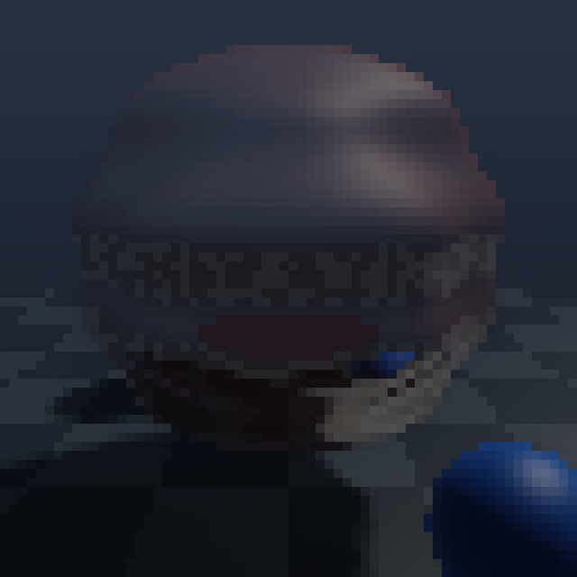

# Ruby Raytracer

Tiny live Ruby raymarcher. It renders a low-resolution signed-distance-field scene into a scaled Raylib texture: a centered reflective sphere, smaller colored spheres, basic lighting, soft shadows, and a checkered floor.

The scene is loosely ported from `~/Coding/Graphics/raymarch-dd`: orbit camera, narrow FOV, reflective sphere material, sky reflection, and checker floor.

The point is readability: `Vec3` has overloaded operators, the renderer is CPU-side Ruby, and the scene code is compact enough to poke at.



## Run Live

```bash
bundle install
bundle exec ruby bin/live
```

Useful knobs:

```bash
WIDTH=96 HEIGHT=54 SCALE=10 bundle exec ruby bin/live
WIDTH=160 HEIGHT=90 SCALE=6 bundle exec ruby bin/live
```

Lower resolution is much faster. `64x64` is the default. The live path uploads one pixel buffer to one Raylib texture per frame instead of drawing thousands of individual objects.

## Render A Still

If the window dependency is annoying, render a plain PPM image:

```bash
bundle exec ruby bin/render_ppm
```

Then open `frame.ppm` with an image viewer that supports PPM.

## Files

- `lib/vec3.rb`: `Vec3` with `+`, `-`, unary `-`, `*`, `/`, `dot`, `cross`, `normalize`.
- `lib/raymarcher.rb`: camera, SDF scene, sphere tracing, normals, lighting, shadows, sky.
- `bin/live`: Raylib live texture-buffer renderer.
- `bin/render_ppm`: no-window still renderer.
